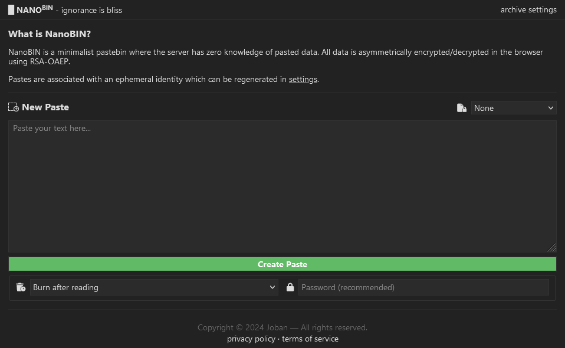
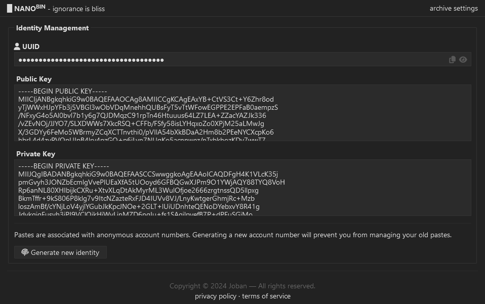

# 🤷‍♂️ About

NanoBIN is a <a href="https://pastebin.com/">Pastebin</a> clone that originated from a friendly competition among friends. Determined not to be outdone, I placed ridiculous restrictions on myself, creating an over-engineered implementation with unnecessary privacy features.

The project is in its alpha stage; while the core functionality is in place, it's not yet at a 1.0 release in my eyes.

# 📖 Philosophy

- Server must have zero knowledge of paste content.
- Ephemeral accounts.
- Balance privacy, security, and anonymity.

I'm re-evaluating my life choices as to why I chose such a restrictive security/privacy philosophy. It led me down the rabbit hole of how best to implement broadcast encryption, borderline turning the application into a messaging service.

# 🖼️ Screenshot

# 📦 Technologies

### Frontend

- TypeScript/JavaScript
- HTMX
- Web APIs
  - Web Crypto API
- CSS3

### Backend

- Rust
  - Askama (templating)
  - Chrono (date-time)
  - Nanoid (UUID generation)
  - SQLx (SQLite3 driver)
- SQLite3 (database)

# ✨ Features

- Create, share, encrypt (using public-key cryptography), and delete pastes.
- Generates an ephemeral identity consisting of a UUID and RSA key-pair.
- Ability to generate new ephemeral identities.
- Manage pastes associated with your ephemeral identity.

# 🗺️ Roadmap

- Control paste visibility.
- Implement paste expirations (time-based and view-based).
- Add syntax highlighting to pastes.
- Create a public key address book.
- Enhance user experience with QR codes.
- Expand REST API.
- Create a Docker image for easier self-hosting.

# 🤔 Considerations

- To what extent does zero knowledge apply?
  - Are pastes stored on the server?
  - Are identities (to include public/private keys) stored on the server?
  - How much of the application can be client-side?
- What information will be tracked, and how does it affect user anonymity?
- How will identities work across multiple devices?
- Is federated functionality possible?
- How will broadcast encryption be implemented?
  - How will authorization be managed?
  - How can we reduce the overhead of broadcast encryption to be less _chatty_?
